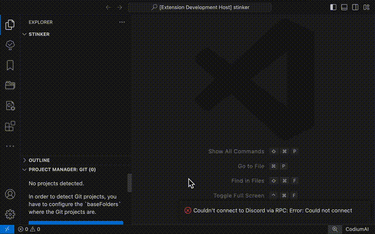

# C++ Makefile Project Creator

Create a simple C++ Makefile project.

## Features

Create a simple project file structure for C++ projects. Includes a Makefile and main.cpp skeleton. Best if used in conjunction with C++ class maker extensions.

Use Ctrl + Shift + P to generate the file structure and files in the current directory.

---

## Requirements

None yet.

## Extension Settings

Just default from yeoman.
Still new to making VSCode extensions.

This extension contributes the following settings:

* `myExtension.enable`: Enable/disable this extension.
* `myExtension.thing`: Set to `blah` to do something.

## Known Issues

None yet.

## Release Notes

None yet.

### 0.0.1

Initial release.